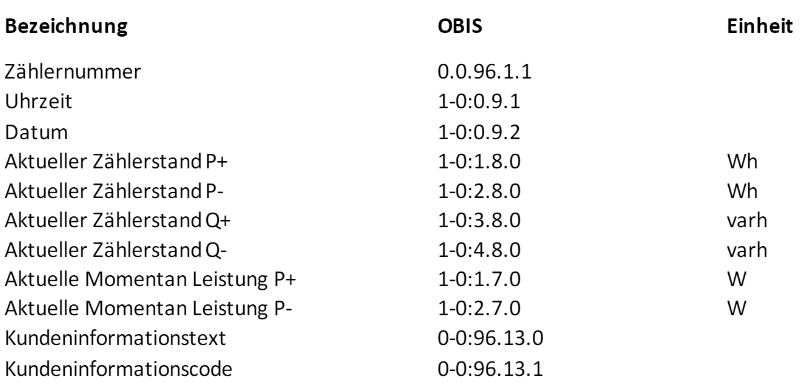
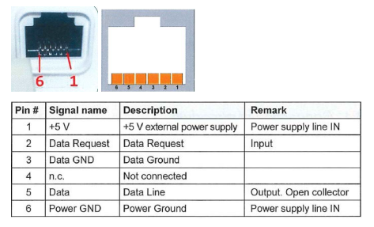
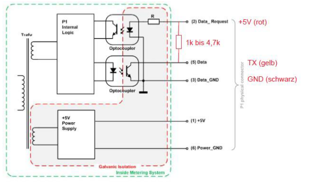
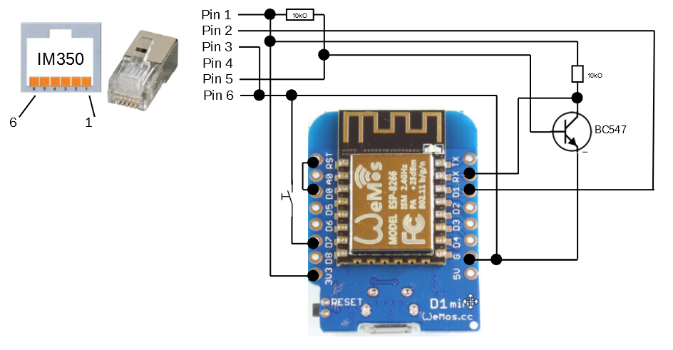
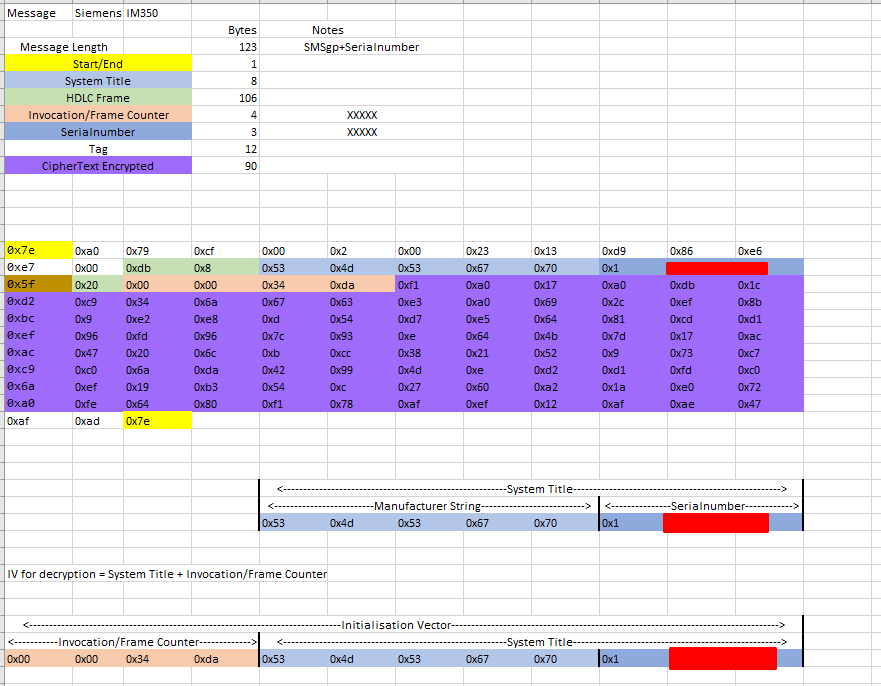

# esphome_im350
Custom Component for ESP Home to support the IM350 (Smart Meter from a local provider in Austria/Carinthia.)

From the provider i didn't get detailed instructions how i get the information from the customer interface or how i decrypt it, so i researched a lot and here are all information's i found for the device, i hope this will help other people who try to get the data from their smart meters.

The easiest solution to translate and decrypt the data is to use a device which supports python (raspberry for example) and then use the python library: [https://github.com/Gurux/Gurux.DLMS.Python](https://github.com/Gurux/Gurux.DLMS.Python)

But i wanted a solution which could run on an ESP and a ESPHome Integration.

# ESPHome Installation
see esp_home folder.

# Python Examples
Two example files in python to translate the message from the meter.

# Standalone Version for testing
see standalone_version folder for more information.

# Provider Documentation for the Customer Interface of the Smart Meter
* [Provider Information for IMx50 1](docs/provider_informations/im350.pdf)
* [Provider Information for IMx50 2](docs/provider_informations/IMx50_1.pdf)
* [Provider Information for IMx50 3](docs/provider_informations/IMx50_2.pdf)
* [Provider Information for Iskra](docs/provider_informations/iskra.pdf)

# Other Projects, Useful Links
This sources have helped a lot to get this working.
* [https://www.photovoltaikforum.com/thread/139837-siemens-im350/?pageNo=10](https://www.photovoltaikforum.com/thread/139837-siemens-im350/?pageNo=10)
* [https://github.com/saghonfly/shrdzm/wiki/IM350](https://github.com/saghonfly/shrdzm/wiki/IM350)
* [http://www.weigu.lu/microcontroller/smartyReader_P1/index.html](http://www.weigu.lu/microcontroller/smartyReader_P1/index.html)
* [http://www.gurux.fi/](http://www.gurux.fi/)
* [Gurux DLMS Director Tool](http://www.gurux.fi/Downloads/gxdlmsdirector46/GXDLMSDirector.application) with this tool you can decrypt the message (if you have the decryption key) this was very useful!
* [https://gitlab.com/astrnad/szreader](https://gitlab.com/astrnad/szreader) Python project if you like to use a raspberry

# Requirements
* 1xESP32 board (ESP8622 should also work, but was not tested)
* **Your Decryption (Block Cipher Key) -> you can get this key from your network power provider!**
* 1xRJ12 Cable (or you build your own of another cable with 6 lines if you have the crimp tools and jacks)
* 1xTransistor (i used a S8050)
[https://components101.com/transistors/s8050-transistor-pinout-equivalent-datasheet](https://components101.com/transistors/s8050-transistor-pinout-equivalent-datasheet)
* 2xResistors 4.7k-10k
* A strip board
* Some DuPont connectors and a crimp tool
* Some Wires

# Data Output of the Customer Interface

# Circuit Diagramm
For this Smart Meter you need a external Power source, other devices/models don't need that - if you have another device please ask your power network provider for a pinout diagram or documentation.

# Customer Interface Pinout

## Pinout Notes
For powering up the device 3.3v from the ESP is enough!
Pin 1/6 is for the internal power supply.
Pin 2 is the data request pin this one also needs 3.3v/5v.
Pin 5 sends out the data - you need a pull up resistor (i'm using a 10k resistor) here and a transistor for inverting the signal.

## Pinout Diagrams from the providers

Basically i used this diagram (but with another esp32 board [az-delivery ESP32 D1 Mini NodeMCU](https://www.az-delivery.de/en/products/esp32-d1-mini?_pos=2&_sid=4f329af42&_ss=r))

**Source: (https://github.com/saghonfly/shrdzm/raw/dev/hardware/IM350_2.png)**

# Example Message

# Workflow
1. Set Pin2 of Customer Interface to High
2. Read Data from Serial Port
3. Set Pin2 to low
4. Check if message is starting and ending with 7E
5. Decrypt the cipher text
6. Validate decrypted cipher text with current date cause validate with tag is not working..
7. Parse decrypted cipher text
8. Publish data to ESPHome

# Decrypting the message
Messages are encrypted with AES128-GCM. 

Each meter has its own 16 byte encryption key. Ask your provider for the key.

For decryption you need:
* Decryption Key -> 16 Bytes
* Initialization Vector (IV) -> 12 Bytes (Invocation/Frame Counter 4 Bytes + System Title 8 Bytes (Manufacturer String 5 Bytes + Serialnumber 3 Bytes))
* Cipher text-> 90 Bytes
* Additional Authenticated Data (AAD)-> 16 Bytes (Fixed Value: D0D1D2D3D4D5D6D7D8D9DADBDCDDDEDF) i got this value from the Gurux Director Tool
* The GCM Tag-> 12 Bytes (For this meter the tag is empty 000000000000)