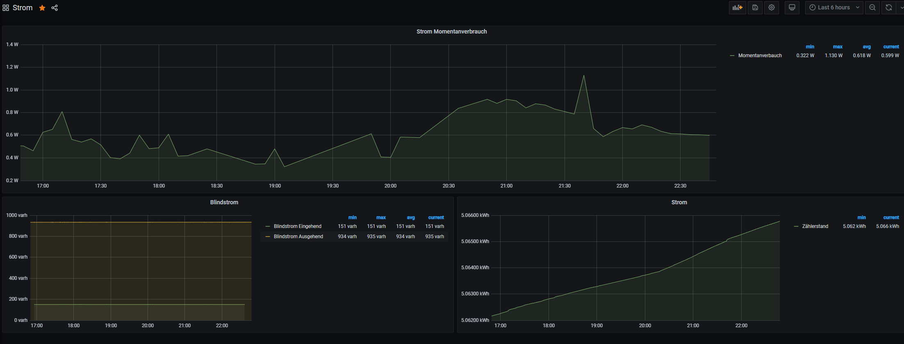

# ESPHome Installation
1. Create a custom_components folder in your esphome directory.
2. Copy the folder siemens_im350 to this directory.
3. Create your config like that:


#### Example ESPHome Yaml
```yaml
esphome:
  name: im350
  platform: ESP32
  board: wemos_d1_mini32
  includes:
    - custom_components/siemens_im350/siemens_im350.h
  libraries:
    - "Crypto" # !IMPORTANT! we need this library for decryption!

wifi:
  ssid: <your wifi sid>
  password: <your wifi key>
  use_address: <your esp ip>

# Enable Web server
web_server:
  port: 80
  auth:
    username: <user>
    password: <password>

# Enable Home Assistant API
api:
  password: <password>

ota:
  password: <password>

# Enable logging
logger:
  level: DEBUG
  
sensor:
  - platform: siemens_im350
    update_interval: 60s
    trigger_pin: 26 # this pin goes to pin 2 of the customer interface and will be set to high before we try to read the data from the rx pin
    rx_pin: 16 # this pin goes to pin 5 of the customer interface
    tx_pin: 17 # not connected at the moment, i added it just in case we need it in the future..
    decryption_key: "<your 16 Byte decryption key>" # you get the key from your provider!
    use_test_data: false # that was just for debugging, if you set it to true data are not read from serial and the test_data string is used
    test_data: "<test data hex string>"
    delay_before_reading_data: 1000 # this is needed because we have to wait for the interface to power up, you can try to lower this value but 1 sec was ok for me
    max_wait_time_for_reading_data: 1100 # maximum time to read the 123 Bytes (just in case we get no data)
    ntp_server: "<ip of you ntp server>" # if no ntp is specified pool.ntp.org is used
    ntp_gmt_offset: 3600
    ntp_daylight_offset: 3600
    counter_reading_p_in:
      name: reading_p_in
      filters:
        - lambda: return x / 1000;
      unit_of_measurement: kWh
      accuracy_decimals: 3
    counter_reading_p_out:
      name: reading_p_out
      filters:
        - lambda: return x / 1000;
      unit_of_measurement: kWh
      accuracy_decimals: 3
    counter_reading_q_in:
      name: reading_q_in
      filters:
        - lambda: return x / 1000;
      unit_of_measurement: kvarh
    counter_reading_q_out:
      name: reading_q_out
      filters:
        - lambda: return x / 1000;
      unit_of_measurement: kvarh
    current_power_usage_in:
      name: power_usage_in
      filters:
        - lambda: return x / 1000;
      unit_of_measurement: kW
      accuracy_decimals: 3
    current_power_usage_out:
      name: power_usage_out
      filters:
        - lambda: return x / 1000;
      unit_of_measurement: kW
      accuracy_decimals: 3
  # Extra sensor to keep track of uptime
  - platform: uptime
    name: IM350_Uptime Sensor
switch:
  - platform: restart
    name: IM350_Restart
```

# Example Output ESPHome Log


# Example Grafana Graphs
