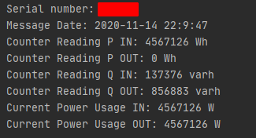

# Python Example Files
Two example files in python to translate the message from the meter.

One File uses the [gurux](https://github.com/gurux/gurux.dlms.python) library and the other the  [cryptography](https://github.com/pyca/cryptography) library.

## Usage
Just enter enter the message from you smart meter and your decryption key. (you get the key from your provider)

## Example Output
